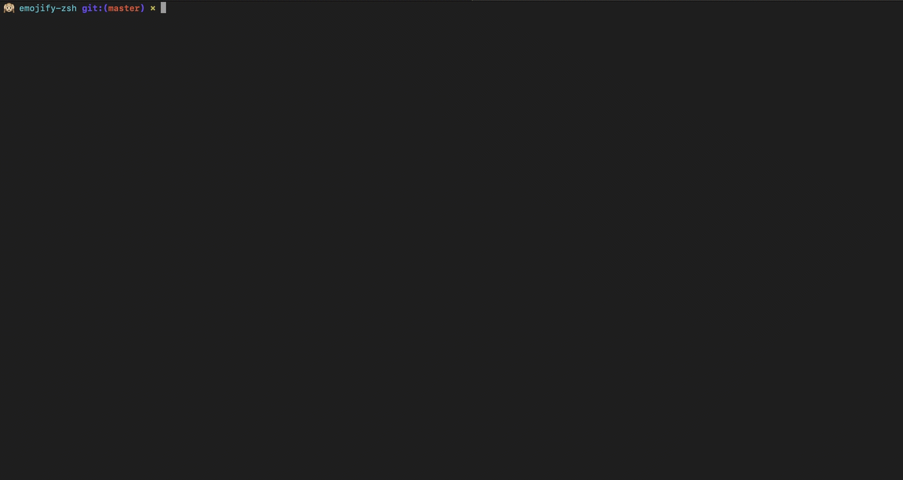

## Emojify-Zsh Theme

Emojify-zsh is a [oh-my-zsh](https://github.com/robbyrussell/oh-my-zsh) fun theme for emoji lovers that adds emojis to your zsh terminal and make your terminal cool.

Emojify will display a random emoji after every successful command you type if your command failed or you type `CTRL+C` then it will show a `Red Arrow` to indicate that your command failed. As of now Emojify-Zsh Support More than 350 Emojis. If you want me to add more emojies in then create an issue and assign it to me :wink:, I'll try to add more.


### Prerequisites

* [oh-my-zsh](https://github.com/robbyrussell/oh-my-zsh)

### Setup

1. Download Emojify-zsh theme as a oh-my-zsh custom theme:

```bash
 $ mkdir -p $ZSH_CUSTOM/themes && curl -o $ZSH_CUSTOM/themes/emojify_zsh.zsh-theme https://raw.githubusercontent.com/rohitsSpace/emojify-zsh/master/emojify_zsh.zsh-theme
```

2. Set `ZSH_THEME` to `emojify_zsh` in your `~/.zshrc`.

  > **Note:** `Make sure you are not exporting this in the last of the ~/.zshrc` it will not going to work for new session of the terminal, My recommendation is Export this at the top of the file.

```bash
$ vim ~/.zshrc
 # ZSH_THEME='emojify_zsh'
```

3. Reload your zsh configuration and Voila! Emojify is watching over you. :sunglasses:

```bash
$ source ~/.zshrc
```

### Contributing

Feel free to contribute, even if it's to add an emoji. :wink: Just fork it :fork_and_knife: and raise a pull request.
